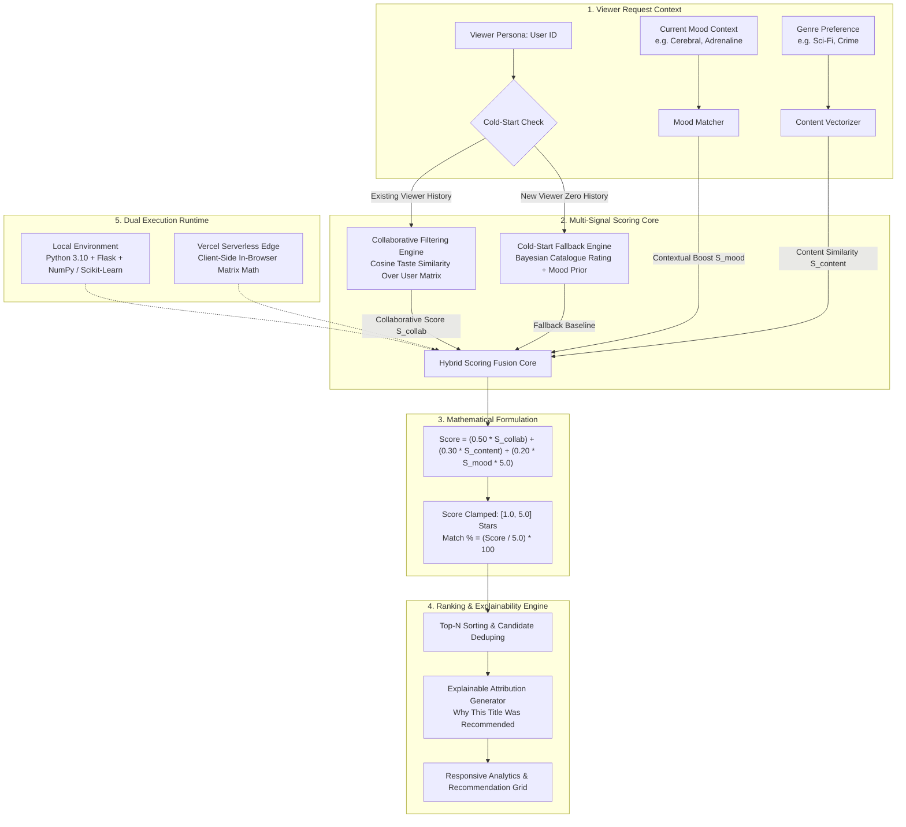

# BingeBot: Hybrid OTT Content Recommendation Engine

A mathematical, multi-signal recommendation engine and interactive web console that combines **Collaborative Filtering** (viewer taste similarity), **Content Trait Similarity** (genres and themes), and **Mood Tone Context** for streaming discovery.

Built to run **100% self-contained** with **zero server dependencies on Vercel** and **zero paid subscriptions**.

---

## Key Features

- **Tri-Hybrid Ranking Formula**: Mathematically balances collaborative user signals (50%), content similarity (30%), and viewer mood boost (20%).
- **Automated Cold-Start Fallback**: Instantly provides top-rated, mood-filtered recommendations for new viewers with zero interaction history.
- **Explainable Attribution**: Every suggestion breaks down *why* it was selected (similar viewer ratings + content overlap + mood boost).
- **Dual-Mode Architecture**: Runs as a full Python Flask backend locally (`http://127.0.0.1:5001`), or as a zero-server Edge application when deployed to Vercel.
- **Executive Earth Design**: Styled in a refined, high-contrast masculine palette (Terracotta Rust, Burnished Amber, Forest Green, Deep Charcoal on warm ivory).

---

## System Architecture

BingeBot operates on a multi-signal algorithmic architecture that synthesizes behavioral collaborative patterns with intrinsic content metadata and real-time contextual intent.

### Architectural Diagram



### Recommendation Formulation & Mathematical Model

For an active viewer $u$ and candidate title $i$, the engine evaluates affinity using a linear weighted combination of three distinct signals:

$$\text{Score}(u, i) = \left(w_{\text{collab}} \times S_{\text{collab}}(u, i)\right) + \left(w_{\text{content}} \times S_{\text{content}}(u, i)\right) + \left(w_{\text{mood}} \times S_{\text{mood}}(m, i) \times 5.0\right)$$

Where default weights are calibrated to prioritize behavioral affinity while maintaining contextual discovery:
- **Collaborative Weight** ($w_{\text{collab}}$): `0.50` (50%)
- **Content Weight** ($w_{\text{content}}$): `0.30` (30%)
- **Mood Context Weight** ($w_{\text{mood}}$): `0.20` (20%)

#### 1. Collaborative Signal ($S_{\text{collab}}$)
Evaluates peer viewer similarity across the interaction matrix:
$$S_{\text{collab}}(u, i) = \frac{\sum_{v \in N(u)} \text{sim}(u, v) \cdot r_{v, i}}{\sum_{v \in N(u)} |\text{sim}(u, v)|}$$
Where $\text{sim}(u, v)$ is the Pearson or Cosine correlation between viewers $u$ and $v$ across co-rated titles.

#### 2. Content Signal ($S_{\text{content}}$)
Measures the cosine similarity between the candidate title's genre/theme vector and the profile centroid of titles highly rated by viewer $u$:
$$S_{\text{content}}(u, i) = \cos(\vec{P}_u, \vec{V}_i) \times 5.0$$

#### 3. Contextual Mood Boost ($S_{\text{mood}}$)
Matches candidate title tone attributes (e.g., `cerebral`, `dark`, `uplifting`, `intense`) with the viewer's immediate situational mood:
$$S_{\text{mood}}(m, i) = \begin{cases} 1.0 & \text{if } m \in \text{Moods}(i) \\ 0.0 & \text{otherwise} \end{cases}$$

#### 4. Normalization & Cold-Start Fallback
- **Clamping**: All computed scores are clamped to $[1.0, 5.0]$ stars.
- **Match Percentage**: Strictly normalized from $0\%$ to $100\%$:
  $$\text{Match \%} = \min\left(100, \max\left(0, \text{round}\left(\frac{\text{Score}}{5.0} \times 100\right)\right)\right)$$
- **Cold-Start Handling**: When a new user has zero prior ratings, $S_{\text{collab}}$ falls back to the Bayesian-damped catalogue average rating, enriched by mood alignment:
  $$\text{Score}_{\text{cold}}(i) = (0.80 \times R_i) + (0.20 \times S_{\text{mood}} \times 5.0)$$

---

## Local Setup & Quick Start

### 1. Clone the Repository
```bash
git clone https://github.com/keshav-x/BingeBot.git
cd BingeBot
```

### 2. (Optional) Create Virtual Environment
```bash
python -m venv venv
# Windows:
venv\Scripts\activate
# macOS/Linux:
source venv/bin/activate
```

### 3. Install Dependencies
```bash
pip install -r requirements.txt
```

### 4. Run the Local Server
```bash
python app.py
```
Open **`http://127.0.0.1:5001`** in your browser.

---

## How to Deploy on Vercel (Zero Server Needed)

BingeBot is architected to run on Vercel **without needing any backend server, subscription, or container**:

1. Fork or push this repository to your GitHub account (`keshav-x/BingeBot`).
2. Log in to [Vercel](https://vercel.com) and click **"Add New Project"**.
3. Import the `BingeBot` repository.
4. Leave all build settings as default (Framework Preset: **Other**, Build Command: empty, Output Directory: `./`).
5. Click **"Deploy"**.

Vercel will serve `index.html` directly from its global Edge network. The recommendation engine executes in the browser in `<1ms` with full functionality.

---

## REST API Specification (When Running Locally)

### Compute Recommendations
- **Endpoint**: `POST /api/recommend`
- **Payload**:
  ```json
  {
    "user_id": "U001",
    "mood": "cerebral",
    "genre": "Sci-Fi",
    "top_n": 3
  }
  ```
- **Response**:
  ```json
  {
    "user_id": "U001",
    "is_cold_start": false,
    "recommendations": [
      {
        "title": "Inception",
        "year": 2010,
        "genre": ["Sci-Fi", "Thriller"],
        "catalogue_rating": 4.8,
        "hybrid_score": 4.8,
        "scores": {
          "collaborative": 4.8,
          "content": 4.2,
          "mood_boost": 0.2
        },
        "explanation": "Users with similar taste rated this highly; shares genre traits; matches requested cerebral mood."
      }
    ]
  }
  ```

---

## Project Structure

```
BingeBot/
├── index.html                  # Standalone Vercel Edge frontend (embedded engine)
├── vercel.json                 # Vercel deployment configuration
├── app.py                      # Flask REST API & recommendation engine
├── requirements.txt            # Minimal dependencies (Flask, scikit-learn, numpy, pandas)
├── README.md                   # Project documentation & architecture
├── sample_data/
│   ├── catalogue.json          # 6 curated benchmark films
│   └── interactions.json       # Verified viewer ratings
└── templates/
    └── dashboard.html          # Server-rendered Flask template
```

---

## Author

Developed by **Keshav Chaudhary** ([@keshav-x](https://github.com/keshav-x)).
